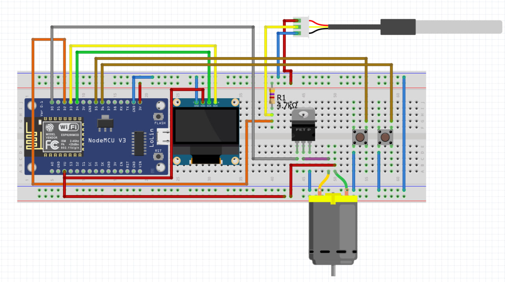

[Скачать схему подключения (JPEG)](docs/schematic.jpg)

**Умная система контроля температуры** на базе ESP8266 с управлением вентилятором и OLED‑дисплеем.

---

## Описание проекта

Этот проект демонстрирует современный ООП‑подход при разработке встроенных систем на ESP8266. Система:

- Считывает температуру с датчика **DS18B20** каждые 1 секунду  
- Управляет скоростью вентилятора (DC‑мотор) через MOSFET **IRLZ44N** по ШИМ (PWM) в трёх режимах:  
  - **AUTO**: автоматически регулирует скорость в зависимости от температуры  
  - **MANUAL**: устанавливает фиксированную среднюю скорость (50 %)  
  - **OFF**: вентилятор выключен  
- Отображает текущую температуру, режим и скорость вентилятора на **OLED SSD1306**  
- Позволяет переключаться между режимами кнопками **MODE (D5)** и **SET (D6)** с антидребезгом  
- Сохраняет выбранный режим в **EEPROM** для восстановления после перезагрузки  

---

## 📋 Содержимое репозитория

SmartTempControl\_ESP8266\_OOP/
│
├── SmartTempControl\_ESP8266.ino   # Главный скетч с setup() и loop()
├── src/                           # Исходники C++ классов
│   ├── TemperatureSensor.h/.cpp   # Класс работы с DS18B20
│   ├── FanController.h/.cpp       # Класс управления ШИМ‑вентилятором
│   ├── OLEDDisplay.h/.cpp         # Класс для OLED SSD1306
│   ├── EEPROMManager.h/.cpp       # Класс для работы с EEPROM
│   ├── ButtonHandler.h/.cpp       # Класс обработки кнопок
│   └── ModeManager.h/.cpp         # Класс управления режимами
├── docs/                          # Документация и схемы
│   └── schematic.jpg              # Схема подключения в JPEG
└── README.md                      # Этот файл

---

## 🛠️ Необходимые компоненты (Hardware)

- **ESP8266 NodeMCU 1.0 (ESP‑12E Module)**  
- **DS18B20** — цифровой датчик температуры  
- **MOSFET IRLZ44N** — логический N‑канальный MOSFET  
- **DC‑вентилятор** (5–12 V)  
- **Диод 1N4007** — защитный выпрямительный  
- **OLED 128×64 SSD1306** (I2C)  
- **2 × кнопки** (тактовые) для MODE/SET  
- Провода, макетная плата, внешний источник питания 5–12 V для вентилятора  

---

### Таблица подключения

| ESP8266 pin | Компонент               | Примечание                  |
|------------:|-------------------------|-----------------------------|
| 3V3         | VCC датчика и OLED      | 3.3 В питание             |
| GND         | GND всех компонентов    | Общий «земля»             |
| D2          | DATA DS18B20            | OneWire                   |
| D3 (SDA)    | SDA OLED                | I2C                       |
| D4 (SCL)    | SCL OLED                | I2C                       |
| D1          | Gate MOSFET             | Через 10 кΩ к ESP8266 D1  |
|             | MOSFET → мотор          | Drain → «−» мотора        |
|             |                         | Source → GND              |
| D5          | MODE button             | INPUT_PULLUP              |
| D6          | SET button              | INPUT_PULLUP              |

---

## 🔧 Установка и использование

1. **Arduino IDE** (рекомендуется ≥ 1.8.5).  
2. **Плата**: выберите **NodeMCU 1.0 (ESP‑12E Module)**.  
3. **Библиотеки**: через **Скетч → Подключить библиотеку → Управление библиотеками** установите:  
   - OneWire  
   - DallasTemperature  
   - Adafruit_GFX  
   - Adafruit_SSD1306  
4. **Откройте** `SmartTempControl_ESP8266.ino`.  
5. **Выберите COM‑порт** и нажмите **«Загрузить»**.  

---

## 📂 Архитектура кода

- **OOП‑подход**: каждая зона ответственности в своём классе.  
- **TemperatureSensor**: инициализация и чтение DS18B20.  
- **FanController**: настройка ШИМ, логика скорости.  
- **OLEDDisplay**: отрисовка на SSD1306.  
- **EEPROMManager**: сохранение/загрузка режима.  
- **ButtonHandler**: чтение кнопок, антидребезг.  
- **ModeManager**: переключение режимов, сохранение в EEPROM.  

---

